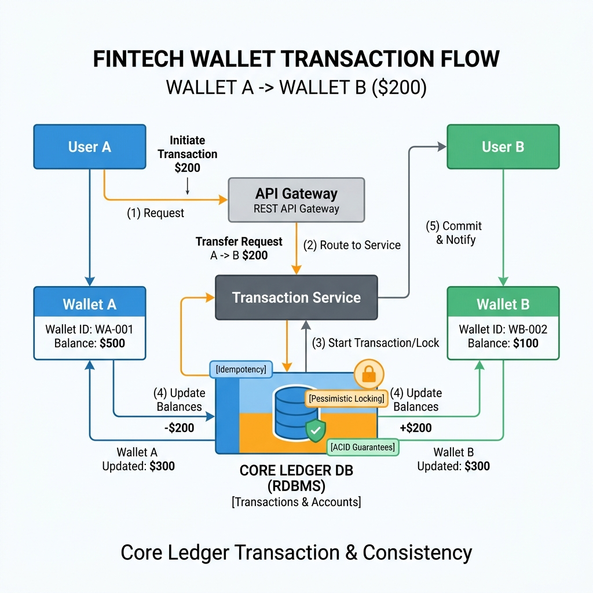

# Diagrama de Arquitectura - Wallet Service

Este diagrama representa el flujo de datos y la infraestructura del sistema, desde la solicitud del cliente hasta las garantías de integridad en la base de datos PostgreSQL, abordando los escenarios de condiciones reales especificados en los requerimientos.

## 1. Vista de Alto Nivel

*Arquitectura abstracta y simplificada del Wallet Service*

## 2. Flujo de Garantías ante Condiciones Reales

El siguiente diagrama detalla cómo reacciona el sistema ante los 4 escenarios críticos de evaluación:
1. Requests paralelos (Condición de carrera).
2. Reintentos de cliente sin respuesta (Idempotencia).
3. Reinicio del proceso a mitad de operación (Transacciones ACID).
4. Falla temporal de Base de Datos (Connection Health).

```mermaid
sequenceDiagram
    participant Client as Cliente
    participant Interceptor as Idempotency Interceptor
    participant App as NestJS Wallet Logic
    participant DB as PostgreSQL (ACID)

    %% Escenario 2: Reintentos e Idempotencia
    rect rgb(0, 40, 80)
    Note over Client, DB: Escenario: Cliente reintenta porque no recibió respuesta
    Client->>Interceptor: POST /wallet/deposit (Idempotency-Key: X)
    Interceptor->>Interceptor: Verifica Caché
    alt Key existe en 'idempotency_responses'
        Interceptor-->>Client: Retorna respuesta HTTP original (Sin tocar lógica)
    else Key es nueva
        Interceptor->>App: Continúa procesamiento
    end
    end

    %% Escenario 1: Requests en Paralelo
    rect rgb(60, 20, 60)
    Note over App, DB: Escenario: Dos requests del mismo usuario en paralelo
    App->>DB: Inicia Transacción (BEGIN)
    Note right of App: Ordenamiento determinístico: <br>Siempre bloquea el UUID menor primero
    App->>DB: SELECT * FROM accounts WHERE id = Y FOR UPDATE
    Note right of DB: Bloqueo Pesimista.<br>El request paralelo #2 se encola aquí esperando el lock.
    App->>DB: INSERT INTO movements (..., Idempotency-Key: X)
    end

    %% Escenario 3: Reinicio de Proceso
    rect rgb(20, 60, 20)
    Note over App, DB: Escenario: Proceso muere a mitad de transferencia
    App-xApp: CRASH! (El proceso NestJS se reinicia)
    Note left of DB: La DB no recibe el COMMIT. <br>El bloqueo se libera por desconexión.<br>La transacción se hace ROLLBACK automático. <br>¡Ningún saldo fue alterado!
    end

    %% Escenario 4: Falla Temporal de DB
    rect rgb(80, 40, 0)
    Note over DB, App: Escenario: La DB falla un instante
    DB-xApp: Connection Refused / Timeout
    App-->>Client: Error 500 Interno
    Note right of DB: Gracias al uso de Restricciones 'CHECK (balance >= 0)' y 'DECIMAL(20,2)',<br>incluso en fallos los datos persistidos siguen siendo válidos.<br>La app utiliza retry al inicializar el Pool.
    end

    App->>DB: COMMIT (Termina Transacción)
    App->>Interceptor: Guarda respuesta exitosa en Caché
    Interceptor-->>Client: Retorna HTTP 201 OK
```

### Explicación Técnica de las Defensas:
1. **Requests en Paralelo:** Resueltos mediante *Pessimistic Locking* (`SELECT FOR UPDATE`) para encolar operaciones sobre la misma cuenta a nivel motor SQL. Los posibles deadlocks en transferencias se evitan al ordenar lexicográficamente las cuentas y bloquear siempre primero la de menor ID.
2. **Reintentos del Cliente:** Sistema de dos niveles (Two-Tier). Primero, un Interceptor de NestJS cachea las respuestas exitosas de cada `x-idempotency-key`. Segundo, la tabla `movements` de PostgreSQL tiene un constraint `UNIQUE` sobre la misma clave como defensa absoluta.
3. **Reinicio de Proceso a la mitad:** Si el contenedor Node.js se apaga en medio del procesamiento de un depósito, no hay daño porque toda modificación (tanto cuentas como ledger inmutable) se ejecuta en una misma transacción ACID. La desconexión de la BD arroja un `ROLLBACK` seguro automático en Postgres.
4. **Falla de BD:** La persistencia mantiene el estado válido 100% de las veces garantizado por constraints físicos a nivel tabla (`balance >= 0`). La capa de aplicación tiene políticas de reconexión y `DatabaseErrorMapper` para no exponer detalles de persistencia al cliente.
