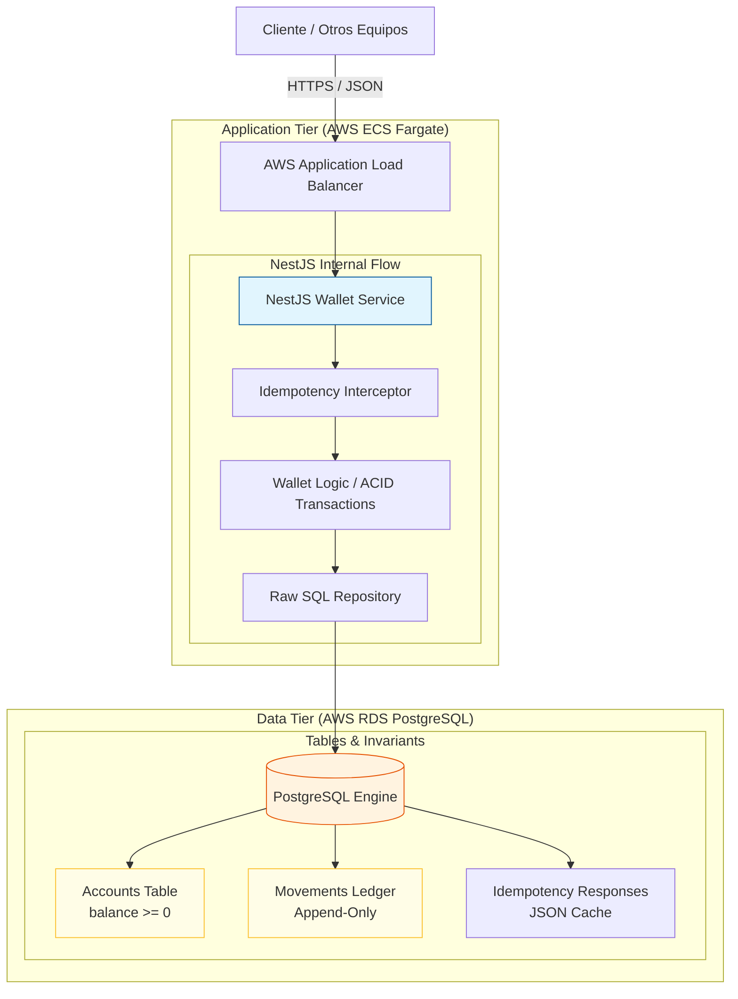

# Diagrama de Arquitectura - Wallet Service

Este diagrama representa el flujo de datos y la infraestructura del sistema, desde la solicitud del cliente hasta las garantías de integridad en la base de datos PostgreSQL.

